# MUSEART: E-Commerce Platform for Art Enthusiasts 

**Museart** is an online B2C platform designed for art enthusiasts to browse, purchase, and engage with a variety of artworks, such as drawings, sculptures, paintings and more. The platform provides a seamless experience for users to explore unique artistic creations, securely shop online, and manage their accounts. Additionally, museart offers a space for learning about various artists and their stories.

## Table of Contents

- [Project Overview](#project-overview)
- [Features](#features)
  - [User Features](#user-features)
  - [Admin Features](#admin-features)
  - [Security Features](#security-features)
- [Technologies Used](#technologies-used)
- [Installation](#installation)
  - [Clone Repository](#clone-repository)
  - [Dependencies](#dependencies)
  - [Environment Variables](#environment-variables)
  - [Database Setup](#database-setup)
  - [Running the Application](#running-the-application)
- [Stripe Payment Integration](#stripe-payment-integration)
- [Web Marketing](#web-marketing)
- [Models](#models)
- [Testing](#testing)
- [Deployment](#deployment)
- [Project Management](#project-management)
- [Marketing Strategy](#marketing-strategy)
- [Contributing](#contributing)
- [License](#license)

## Project Overview
museart was developed to provide art lovers with a platform where they can easily browse and purchase art in a secure, user-friendly environment. It allows users to create accounts, log in, and securely pay for items in their shopping cart using integrated payment solutions. Users can also view their purchase history and read about various artists and their work. Note, this project is still under improvement due to time and other meassures beyond my control. after assessment I am going to greatly enhance the platform and its features. 

## Features

### User Features
1. **Home App**: The Museart landing page welcomes users with a beautiful landing page with a visually immersive design that reflects the brand’s artistic identity. It features a bold logo, vibrant colors, and a clear call-to-action encouraging users to explore. Key elements include: A prominent search bar to help users quickly discover artworks. Navigation links for browsing by category or special offers. Account and cart access for a seamless shopping experience. A modern hero section with a “Shop Now” button to drive user engagement.

This page sets the tone for the rest of the platform — clean, creative, and conversion-focused.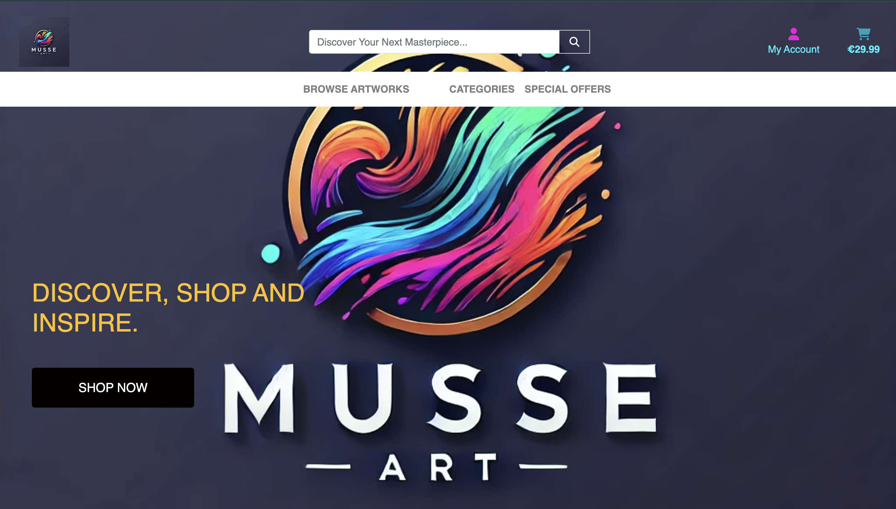  


2. **Products App**
Product Listings**: Users can browse and search through various art categories like paintings and sculptures, view detailed product information, and add items to their cart. Detailed product pages with descriptions, pricing, and images, Category-based browsing , Admin integration for managing products


3. **User Authentication**: Users can create accounts, log in, and manage their profiles, including their saved addresses and personal information.  
.This is the standard allauth login page, custom styled.
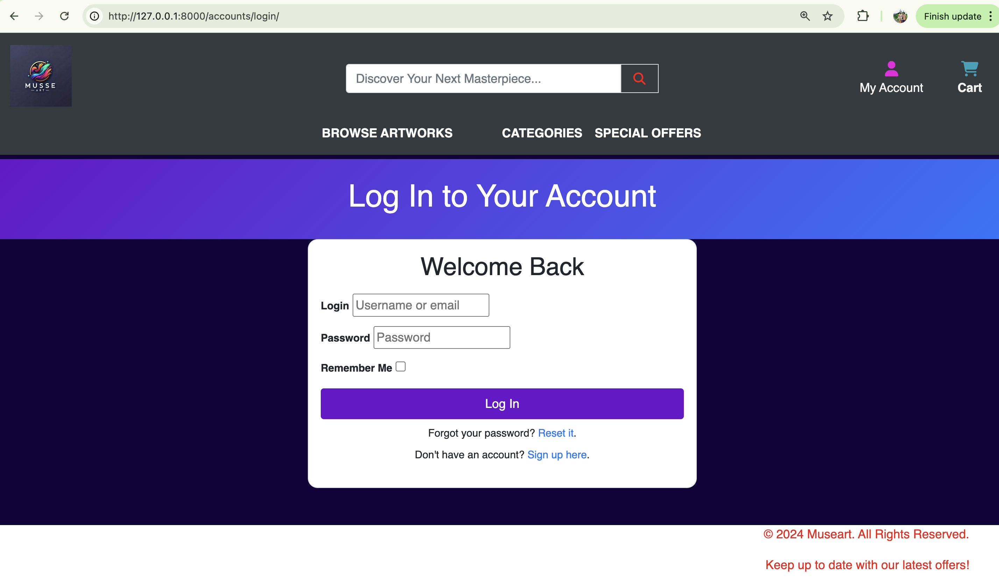,

.This is the standard allauth signup page, with fields for email, username, and password + password confirmation. All fields are required. 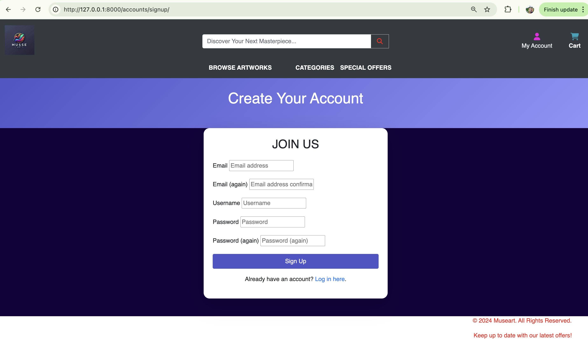

4. Cart App
Session-based shopping cart with item persistence

Add, update, or remove items from the cart

Automatic cart totals and delivery fee calculation

Live cart preview in the navbar (optional) **Shopping Cart**: The cart feature allows users to add and remove items, view their cart contents, and adjust the quantity of products.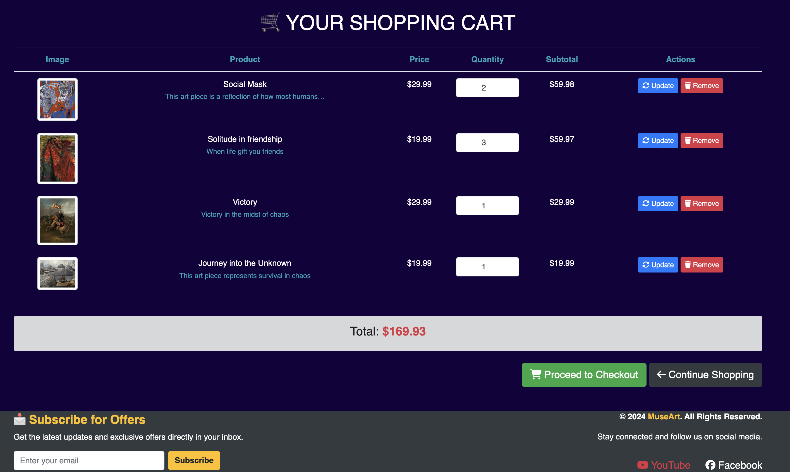

5. Checkout App
Secure checkout flow powered by Stripe PaymentIntent

Stripe Payment Element integration for card handling

Order summary, form validation, and payment confirmation

Dynamic order number generation and order history logging

Checkout success page with order breakdown and confirmation email (PDF invoice included)

Webhook support for verifying payment events

**Checkout and Payment**: Secure payment processing is integrated with Stripe, allowing users to make payments using credit cards. 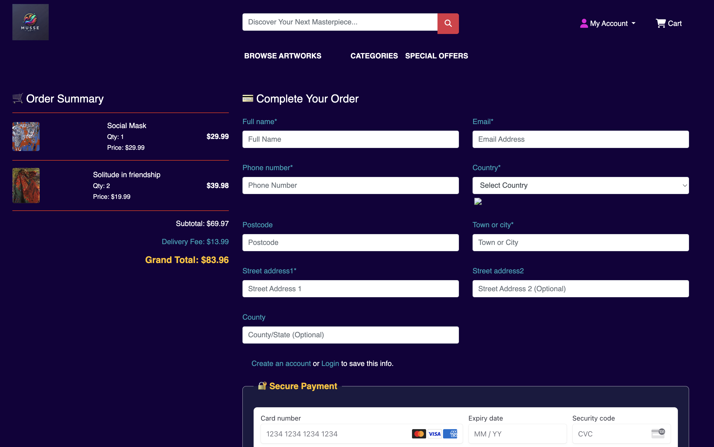, 
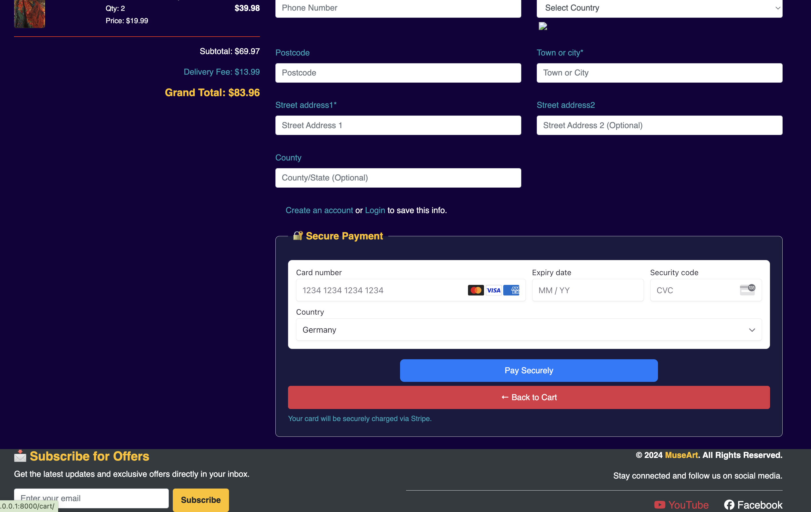, 
,
----
6. ### Checkout Success Page: 
After a successful payment, users are redirected to the Checkout Success page. This page serves as the final confirmation of a completed order and includes a summary of all order details.

 **Purpose**
Provide visual confirmation that the user's order has been successfully placed. Display a detailed summary of the order, including items, prices, and shipping information. Offer post-purchase actions such as printing the order or continuing shopping.

 **Features**
1. Order confirmation message including the customer's email address. 
2. Unique order number for reference and support.
3. Shipping address and contact details.
4. List of purchased items with quantities and line totals.
5. Payment summary with subtotal, delivery fee, and total amount paid.
6. Estimated delivery date.
7. Option to print the order summary or continue shopping.

**Template**
This page is rendered using the checkout/templates/checkout/checkout_success.html template. The layout uses Bootstrap for styling with a clean, modern aesthetic.

**Developer Notes**
The page is served via the checkout_success() view in checkout/views.py. It expects the Order object to be passed in context.
If the user is authenticated and selected "save info" during checkout, their delivery details are saved to their profile.
A confirmation email with a PDF invoice is generated and sent after order completion via the send_order_confirmation() helper function.
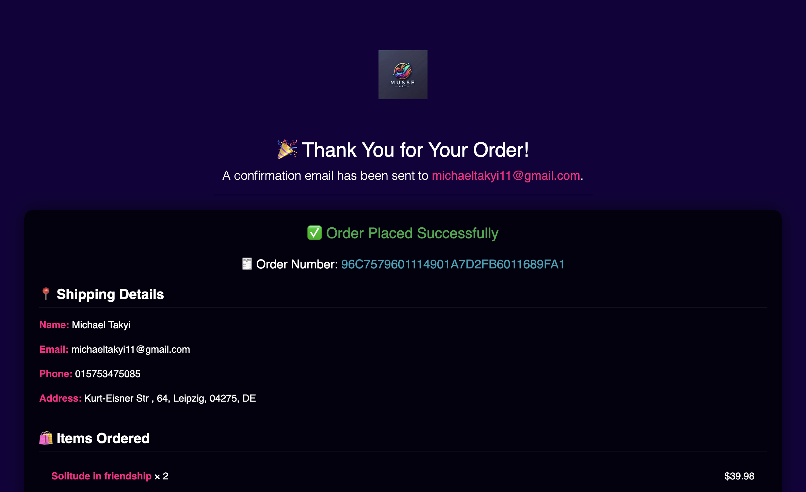
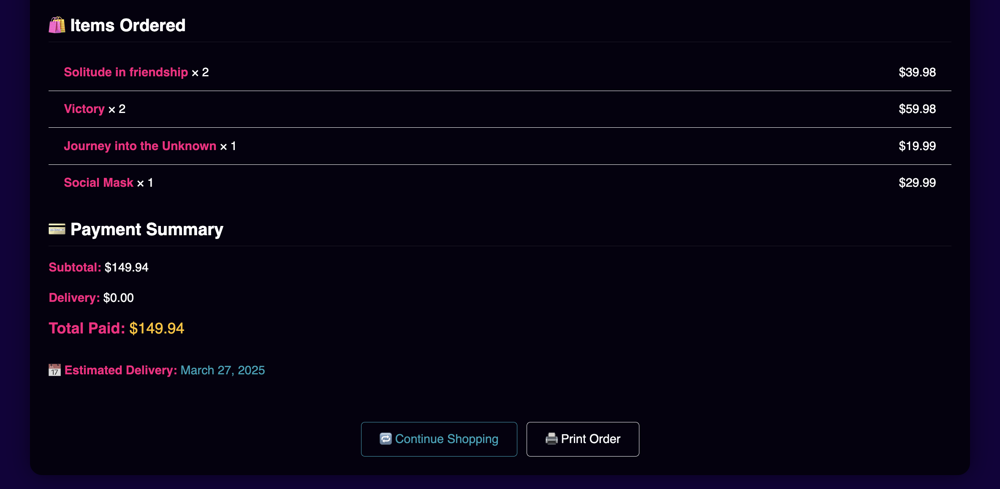
----

## Profiles App
User profile management for authenticated users

Persistent order history with access to past purchases

Option to save default delivery information

Integration with checkout to auto-fill saved details


## Marketing Strategy for Museart
---
## Key Strategies
1. Content Marketing
- **Blog & Interviews** --- Publish artist interviews, behind-the-scenes features, and art care guides.  
- **Email Newsletters** --- Deliver curated updates, promotions, and new collection highlights.

2. Social Media Marketing
- **Visual Platforms (Instagram & Pinterest)** --- High-quality images, Reels, and shoppable pins.  
- **Video Content (YouTube)** --- behind-the-scenes creation process, artist Q&A sessions.

3. Promotions & Discounts
- **Seasonal Sales** --- (e.g., holiday discounts, Black Friday offers)  
- **First-Time Buyer Incentives**  --- Discount codes or exclusive offers for new users.  
- **Referral & Loyalty Programs** --- Encourage word-of-mouth promotion and repeat purchases.

4. Paid Advertising (Budget Permitting)
- **Targeted Social Media Ads**: Instagram, Pinterest, and Facebook, focusing on users interested in art, home decor, and interior design.  
- **Google Ads**: Target users searching for specific artwork styles or artists.

## Primary Platforms & Tools
- **Facebook & YouTube**: Short-form and long-form video content to educate and entertain 
- **Instagram** and **Pinterest** for decor-focused audiences and inspiration boards and for visuals and user engagement.   
- **Email Marketing** for retaining and re-engaging existing subscribers through Personalized communication and promotions.  
- **SEO** Optimizing site content to rank for relevant art-related keywords to attract users searching for art online.

## Web Marketing
A Youtube page was set up as the initial stage of a social media marketing strategy. With description and a url to the page, inviting visitors to view products and services. In case the page is taken down, screenshots are included below...
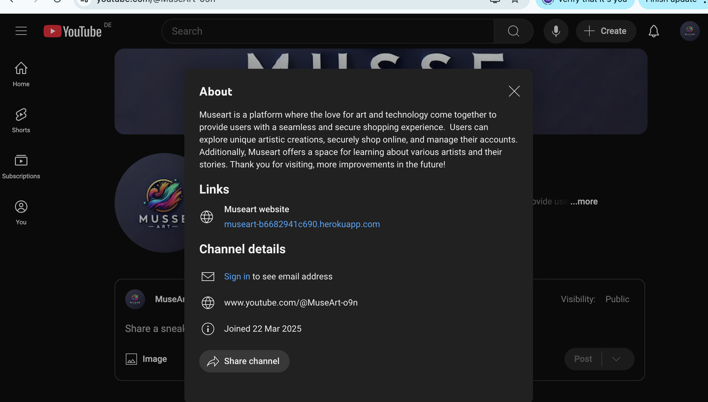
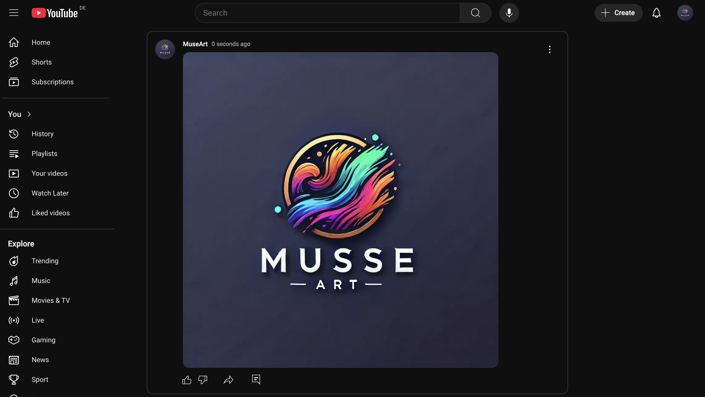
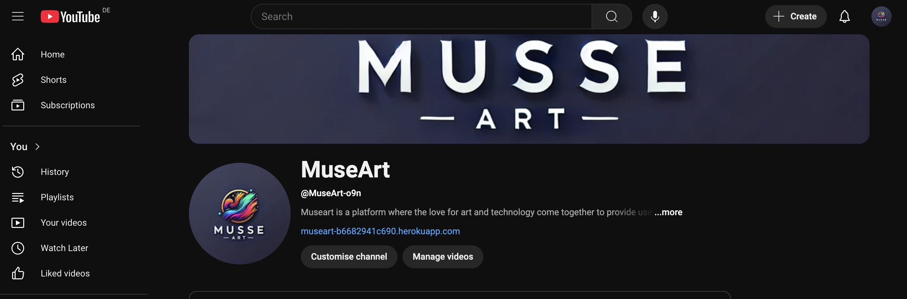
---
## Target Audience

- **Art Enthusiasts & Collectors**: Seeking authentic artworks and artist stories  
- **Home Décor Shoppers**: Looking for unique decorative items  
- **Emerging Artists**: Gaining visibility and community engagement
---
## Marketing Goals
---
1. **Increase Brand Awareness** and drive website traffic.  
2. **Convert Browsers into Buyers** through engaging content and promotions.  
3. **Showcase Independent Artists** and support their work.  
4. **Build a Community** of art enthusiasts around Museart.
---

## Summary
Museart’s marketing focuses on visually-driven social media platforms, educational and inspirational content, and targeted promotions to engage both casual browsers and dedicated art lovers. By supporting artists and delivering valuable, visually-rich content, Museart aims to build a reputable brand and a community of loyal customers.
---

## Models
museart's core models include:

1. **Product**: Contains all the information related to individual products (artworks), including name, description, price, image, and category.
2. **Order**: Stores details of customer orders, including customer information, order total, and delivery address.
3. **OrderLineItem**: Holds details about individual items in an order.
4. **User Profile**: Allows users to save their delivery and personal information for future orders.

## Project Management
We are using GitHub Projects to manage tasks and workflows. Check out our [Kanban Board](https://github.com/michael-takyi23/MuseArt/projects/Museart-project) for the latest updates.

### Admin Features
1. **Product Management**: Admins can add, edit, and remove products, as well as manage product categories.
2. **Order Management**: Admins have access to view and manage user orders, including marking them as fulfilled.
3. **User Management**: The platform allows admin control over user accounts, including viewing user information and handling support queries.

### Security Features
1. **Authentication & Authorization**: museart uses Django Allauth for secure user authentication and registration, including email verification.
2. **CSRF Protection**: Cross-Site Request Forgery protection is enabled to prevent unauthorized actions.
3. **Stripe Payment Integration**: Payments are securely processed through Stripe’s payment gateway, ensuring safe transactions with industry-standard encryption.

## User Experience 
---
- **Design**: 
The Roboto font is used throughout the project. It's a simple, very legible sans-serif font, considered an amazing font because of its versatility and modern appearance, particularly on headings and larger font sizes and has a clean, geometric look that is legible at small sizes. Favicon.io was used to generate a favicon for the project. A favicon is a small, 16x16 pixel icon used on web browsers to represent a website or a web page. Short for “favorite icon", they're also found on your browser's bookmark bar, history and in search results, alongside the page url.

- **Color Palette**: 
The following colour palette was used in the project. [Coolors](https://coolors.co/) is an online tool that was used in generating the color palette via MuseArt's project logo or hero image, which is visible on the landing page. 
 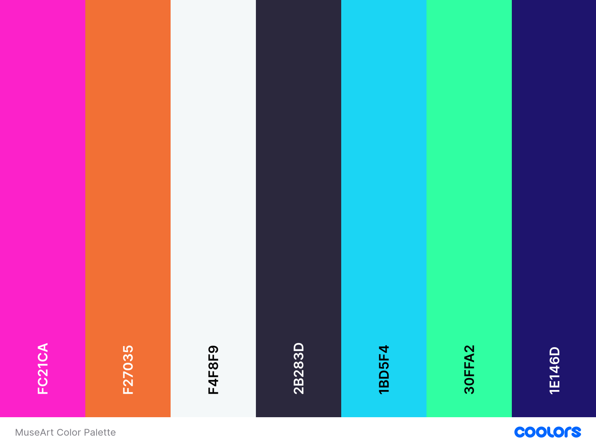

 ## Wireframes 
 
 - **Landing Page**: 
  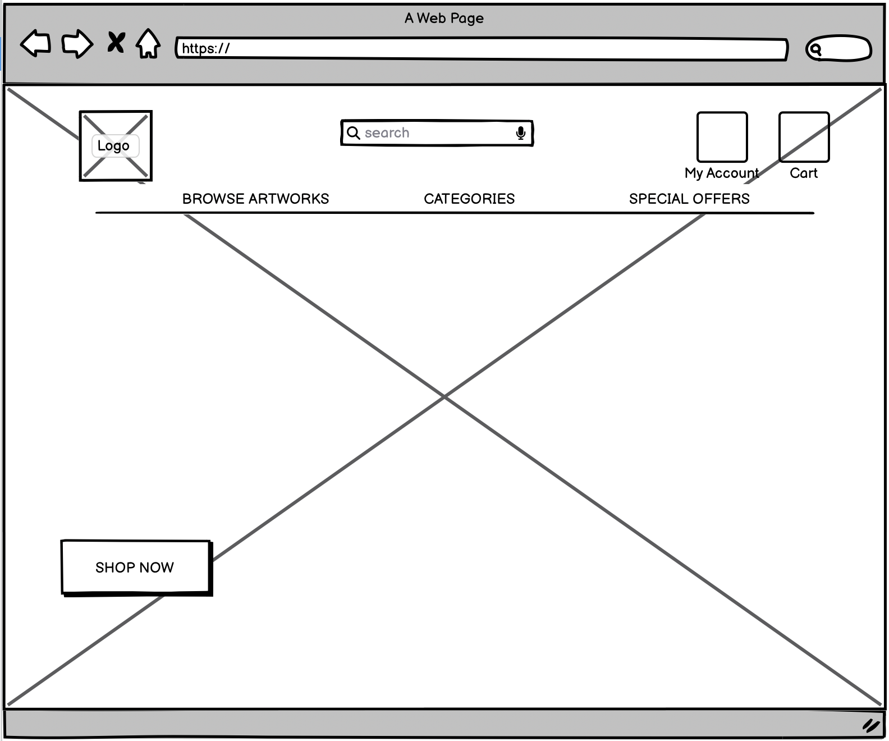

- **Products Display**: 
  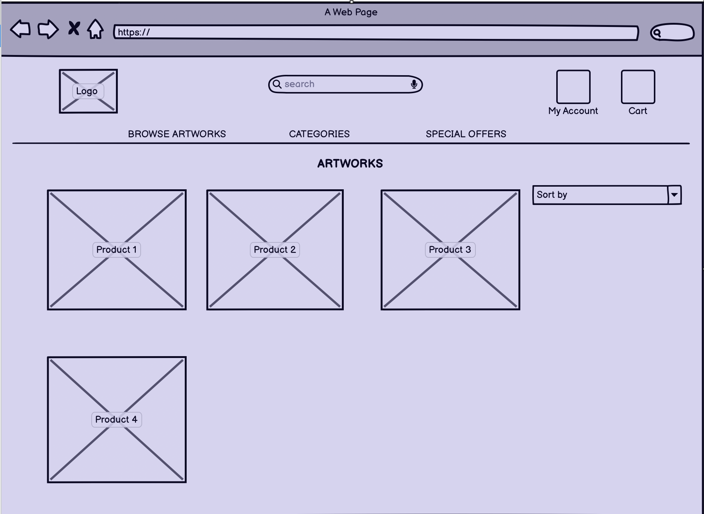

- **Products Details**: 
  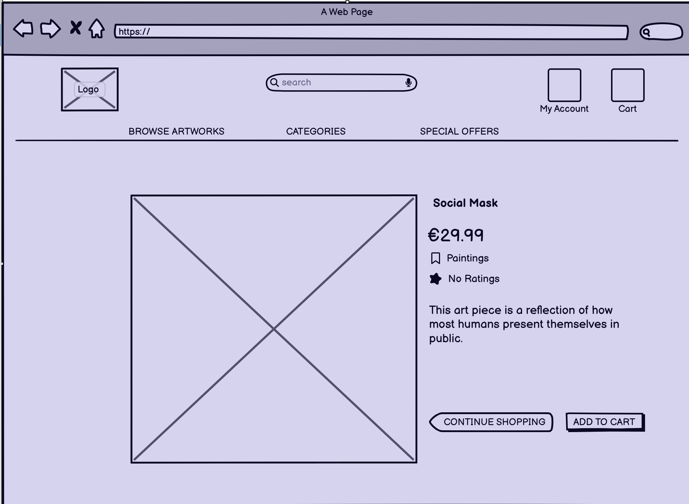

  ## Entity Relationship Diagram (ERD)
    Below is the database structure:
 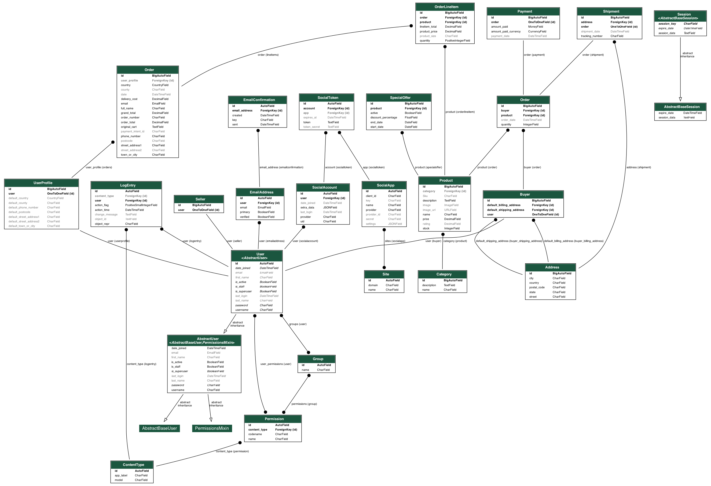

## Technologies Used
- **Front-End**:
  - HTML
  - CSS (custom styling and Bootstrap 4 for responsive design)
  - JavaScript (Stripe integration)
  - Font Awesome (for icons)
- **Back-End**:
  - Django 5.1
  - Python 3.12
  - SQLite (for development) / PostgreSQL (for production)
- **Third-Party Integrations**:
  - **Stripe**: Secure payment gateway for processing transactions.
  - **Crispy Forms**: For better form styling using Bootstrap 4.
  - **AWS S3**: For managing media files and static assets.
  - **Allauth**: For managing user authentication, login, and registration.
- **Version Control**:
  - Git for version control and GitHub for repository hosting.
- **Deployment**:
  - Heroku for hosting the application.
  - AWS S3 for managing static and media files in production.
  ---

## Testing
You can run tests for the application using Django’s built-in test framework:
```bash
python manage.py test

. Manual testing
. Validator testing
. User story testing
. Automated testing

```

## Installation
---
### Clone Repository
1. Clone the repository from GitHub:
   ```bash
   git clone https://github.com/yourusername/museart.git
   cd museart
   ```

### Dependencies
2. Install the project dependencies:
   ```bash
   pip install -r requirements.txt
   ```

### Environment Variables
3. Set up environment variables by creating a `.env` file in the root of the project. Add the following variables:

   ```bash
   SECRET_KEY=<your_django_secret_key>
   DEBUG=True
   STRIPE_PUBLIC_KEY=<your_stripe_public_key>
   STRIPE_SECRET_KEY=<your_stripe_secret_key>
   DATABASE_URL=<your_database_url>
   ```

### Database Setup
4. Migrate the database to set up the necessary tables:
   ```bash
   python manage.py migrate
   ```

5. Create a superuser for accessing the admin panel:
   ```bash
   python manage.py createsuperuser
   ```

### Running the Application
6. Run the development server:
   ```bash
   python manage.py runserver
   ```

Access the application at `http://127.0.0.1:8000/`.

## Stripe Payment Integration
museart is integrated with **Stripe** to handle secure payments. During checkout, users can enter their card details, and Stripe securely processes the transaction. Ensure that the **Stripe public and secret keys** are set in your environment variables.

For testing purposes, use Stripe’s test card numbers, such as:
```
4242 4242 4242 4242 (Visa)
CVC: Any 3 digits
Expiry: Any future date
```
## Deployment
museart is deployed on **Heroku** with a PostgreSQL database for production. Static and media files are served via **AWS S3**. To deploy:

1. Set up your Heroku app and connect it to your GitHub repository.
2. Set the necessary environment variables (as described above) in the Heroku dashboard.
3. Push the code to Heroku:
   ```bash
   git push heroku main

## Acknowledgement 

1. Django: The powerful web framework that served as the foundation of this project.
2. Stripe: For providing the secure payment gateway integration.
3. Bootstrap: The responsive front-end framework that helped with the layout and design of the platform.
4. Crispy Forms: For making form rendering easier and more elegant within Django templates.
5. AWS S3: For handling image and static file management seamlessly in the cloud.
6. FontAwesome: For providing high-quality icons used across the website.
7. Code Institute: For their support and the resources provided during the development of museart.
8. Heroku: For providing hosting and deployment support for museart.
9. ChatGPT: This README and various technical solutions throughout the project were enhanced using ChatGPT, a large language model trained by OpenAI, for brainstorming, code suggestions, and guidance.

## Contributing

If you’d like to contribute to museart, please fork the repository and create a pull request with your changes. All contributions are welcome!

## License

This project is licensed under the MIT License.

---

Museart is a platform where the love for art and technology come together to provide users with a seamless and secure shopping experience. Thank you for visiting, more improvements in the future!